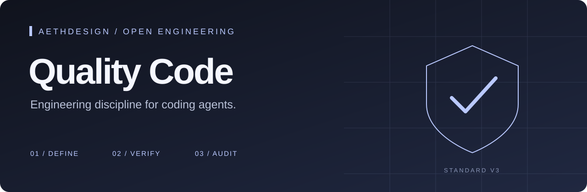

<p align="center"><a href="https://www.aethdesign.com/"></a></p>

<p align="center">
  <a href="https://github.com/aethirex-ai/quality-code/actions/workflows/verify.yml"></a>
  <a href="LICENSE"></a>
  
  
  <a href="https://www.aethdesign.com/"></a>
</p>

# Quality Code

**Make the quality bar explicit before a coding agent writes the first line.**

Quality Code is AethDesign’s open workflow and bootstrap toolkit for agent-assisted software work. It gives each project a compact architectural map, observable acceptance criteria, executable verification profiles, and a risk-based independent audit gate.

Small changes stay small. Higher-risk changes earn stronger evidence.

[Read the visual case study](https://aethirex-ai.github.io/quality-code/) · [Read the standard](docs/STANDARD.md) · [Technical case study](docs/CASE_STUDY.md) · [Start using it](#quick-start)

The reader edition uses AethDesign’s dark editorial design language, with self-hosted fonts and no tracking or scripting. GitHub renders this Markdown with its own interface; the styled edition lives in [docs/index.html](docs/index.html).

## The quality contract

| Change risk | Builder evidence | Independent audit |
| --- | --- | --- |
| **Low** · isolated copy or static presentation | One focused confirmation | Only when requested |
| **Normal** · contained, reversible behavior | Relevant regression tests and changed-scope checks | Only when requested or risk increases |
| **High** · public contracts, persistence, shared components | Focused tests and full verification | Required |
| **Critical** · security, payments, destructive operations | Full and release profiles, relevant failure and recovery evidence | Required |

The highest applicable risk wins. A passing command does not prove the product is correct. Missing required evidence stays visible.

## Quick start

Requires **Python 3.11+**, **Git**, and a POSIX shell for the `./quality` wrapper. The Python CLI has no third-party dependencies.

```sh
git clone https://github.com/aethirex-ai/quality-code.git
cd quality-code

# Bootstrap a project:
python3 scripts/quality_code.py init /path/to/new-project
# Or preserve and adopt an existing project:
python3 scripts/quality_code.py adopt /path/to/existing-project

cd /path/to/your-project
./quality validate
./quality context src/auth/session.py
./quality verify changed
```

**Before relying on the gate:** tailor `MAP.md`, `TESTING.md`, and `.quality/quality.toml` to the actual product. Detected profiles are starting points; `git diff --check` alone is not behavioral verification. Profile names do not guarantee different test coverage. Inspect every command before executing it, including detected package scripts.

For a higher-risk completed change:

```sh
./quality verify full
./quality audit-packet --criteria "Describe the observable outcome and failure behavior" > /tmp/quality-audit-packet.json
```

Give the packet, explicit diff scope, and this repository’s audit skill to a fresh agent. The packet is a handoff, not an audit or a passing verdict. Critical work also requires `./quality verify release` and any applicable platform evidence.

[Full installation and agent setup →](docs/GETTING_STARTED.md)

## What a project receives

| File | Purpose |
| --- | --- |
| `AGENTS.md` | Shared workflow and risk lanes |
| `CLAUDE.md` | Imports the shared project instructions |
| `MAP.md` | Compact boundaries, invariants, and context routing |
| `TESTING.md` | Product risks, evidence requirements, and known gaps |
| `.quality/quality.toml` | Verification commands and path-to-risk routes |
| `quality` + `.quality/quality.py` | Project-local verification and audit handoff CLI |
| `.quality/LICENSE` | Preserves the toolkit license notice in generated projects |
| `.quality/audit-result.schema.json` | Structured `PASS`, `FAIL`, or `BLOCKED` results |

Existing instruction text is merged. Existing map and testing sections are preserved. An unrelated `quality` executable or pre-existing runtime/schema/license under `.quality/` is a collision, not permission to overwrite it. A parent Git repository is reused.

## Efficient delegation

Standard v3 adds provider-neutral subagent guidance. Agents use native runtime discovery and capability metadata to select accessible models and supported effort controls for each bounded task. No model names or fixed rankings are prescribed. Selection considers expected total usage, latency, retries, skill requirements, and product risk. Helper counts and spawn timing follow ready independent work, native capacity, shared resources, and coordination budget; unavailable discovery falls back to the current model.

The primary agent owns integration and validation. Implementation helpers cannot supply the required independent audit. See [the delegation policy](docs/DELEGATION.md) for the decision process, fallbacks, and examples.

## Why AethDesign publishes this

We want the way we build to be inspectable. This repository turns our coding-agent bootstrap into a reusable engineering practice: define the outcome, understand the boundary, test proportionately, and separate implementation from independent review when the risk demands it.

The [case study](docs/CASE_STUDY.md) explains the decisions and limitations. It is a design and implementation case study; it does not claim measured defect reduction, certification, or universal agent compliance.

**AethDesign builds products, platforms, and websites.** Explore our work at [aethdesign.com](https://www.aethdesign.com/?utm_source=github&utm_medium=repository&utm_campaign=quality-code).

## Check the toolkit itself

```sh
./quality validate
./quality verify full
```

The tests use temporary projects and isolated home directories. CI runs the same full profile on Python 3.11–3.14 on Ubuntu and macOS. A configured workflow is not evidence of a successful hosted run; inspect the repository’s Actions results after publication.

## Contribute

Read [CONTRIBUTING.md](CONTRIBUTING.md), [the project map](MAP.md), and [TESTING.md](TESTING.md). Report vulnerabilities through [SECURITY.md](SECURITY.md). The tooling, documentation, and templates are available under the [MIT license](LICENSE).
